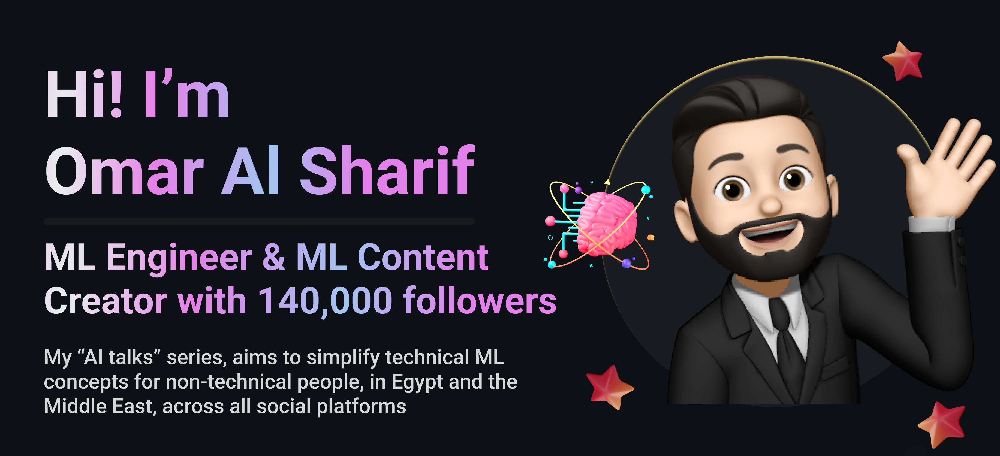

<h3 style="margin-top: 0;">Experience 🏆</h3> 
- **AI Competitions and Hackathons**
  - [**<mark style="background-color: #FFB02E;">`1st Place Team`</mark>** , CUFE Artificial Intelligence Diacritization Competition on kaggle 🥇](https://www.kaggle.com/competitions/cufe-cmp-credit-nlp-fall-2023/leaderboard)
    
  - [Team leader, The International Competition of Military Technical College, AIC-1 ⭐️](https://www.linkedin.com/posts/omar-al-sharif_%D9%8A%D8%B4%D8%B1%D9%81%D9%86%D8%A7-%D9%86%D8%B4%D8%A7%D8%B1%D9%83-%D8%A3%D8%AD%D8%AF-%D8%A3%D8%B6%D8%AE%D9%85-%D9%85%D8%B4%D8%A7%D8%B1%D9%8A%D8%B9-%D8%A7%D9%84%D8%B0%D9%83%D8%A7%D8%A1-%D8%A7%D9%84%D8%A7%D8%B5%D8%B7%D9%86%D8%A7%D8%B9%D9%8A-activity-7085613020566949888-JNS0/?utm_source=share&utm_medium=member_desktop)
  - [AIC-2 2024 Participant ⭐️](https://www.kaggle.com/competitions/mct-aic-2/overview) 

- **Work Experience**
    - [Machine Learning Engineer (Computer Vision), Synapse Analytics](https://www.linkedin.com/posts/omar-al-sharif_happy-to-share-that-i-am-joining-synapse-activity-7239958902203658241--EGo?utm_source=share&utm_medium=member_desktop)
    - [Computer Vision Intern, Synapse Analytics](https://www.linkedin.com/posts/omar-al-sharif_happy-to-announce-that-im-starting-a-new-activity-7207373465840979968-9-xj?utm_source=share&utm_medium=member_desktop)
    - [Generative AI and Machine Learning Intern, SMACRS 🤖](https://www.linkedin.com/posts/omar-al-sharif_glad-to-announce-that-i-have-started-a-new-activity-7094366992412872704-5qId/?utm_source=share&utm_medium=member_desktop)
      
    - [Programming & Robotics Instructor for foreign students from 13 countries, AFS Egypt 🇺🇸🇩🇪🇬🇧🇯🇵🇹🇹🇨🇳🇿🇦🇮🇩🇦🇿🇲🇽🇲🇾🇮🇳🇧🇷](https://www.linkedin.com/posts/omar-al-sharif_honored-to-share-my-intercultural-experience-activity-7094044612536758272-BBsf/?utm_source=share&utm_medium=member_desktop)

### Projects 👨🏻‍💻
- [**AI Arabic Summarizer - من الآخر.ai**](https://www.linkedin.com/posts/omar-al-sharif_%D9%8A%D8%B4%D8%B1%D9%81%D9%86%D8%A7-%D9%86%D8%B4%D8%A7%D8%B1%D9%83-%D8%A3%D8%AD%D8%AF-%D8%A3%D8%B6%D8%AE%D9%85-%D9%85%D8%B4%D8%A7%D8%B1%D9%8A%D8%B9-%D8%A7%D9%84%D8%B0%D9%83%D8%A7%D8%A1-%D8%A7%D9%84%D8%A7%D8%B5%D8%B7%D9%86%D8%A7%D8%B9%D9%8A-activity-7085613020566949888-JNS0/?utm_source=share&utm_medium=member_desktop)

  A transformer-based abstractive Arabic text summarizer to extract key information and generate concise Arabic summaries
- [**AI Arabic Diacritization Engine - مِشَكِّلاتي.ai**](https://www.kaggle.com/competitions/cufe-cmp-credit-nlp-fall-2023/leaderboard)

  A neural and statistical engine for accurately adding diacritics (Tashkeel) to Arabic text. First-place winner on Kaggle for outstanding accuracy
- [**Magic Inpainting**](https://github.com/Omar-Al-Sharif/Magic-Inpainting)  
  An algorithm to magically remove unwanted objects from images and intelligently fill the void with matching backgrounds, in real-time

### Certificates 🏅
- [**Supervised Machine Learning**](https://www.coursera.org/account/accomplishments/certificate/ZUNTWY8EMU89)
- [**Deep Learning with PyTorch**](https://www.datacamp.com/statement-of-accomplishment/course/5ccc6a2fcd61093813c8cd3d5cb633e7e598a5dc)
- [**Supervised Learning with scikit-learn**](https://www.datacamp.com/statement-of-accomplishment/course/7eed98ec23756591b4e6c20faf3e45b1b2e3ecb4)
- [**Unsupervised Learning in Python**](https://www.datacamp.com/statement-of-accomplishment/course/2a7f2c2f96c969f9d6b7013f356dc97a4e65a85f)
- [**Tree-Based Machine Learning Models**](https://www.datacamp.com/statement-of-accomplishment/course/6925fb9363d21cb71c88ea36cae8d7cdef99301b)
- [**Programming in R**](https://www.datacamp.com/statement-of-accomplishment/course/61455bf78110aff3c5df7a4692c078996b5ebbad)
- [**CNNs, Seq Models & Multi I/O Models**](https://www.datacamp.com/statement-of-accomplishment/course/b6da713cb73ebdc422878634b38bedde90fc7eba)
  
### Connect with Me 🤝
<code></code>
<code></code>
<code></code>
<code></code>

